# 一、系统说明

基于springboot+vue+elementui开发的网上订餐系统,系统功能齐全, 代码简洁易懂，适合小白学编程。

# 二、系统架构

###### 前端：vue| elementui

###### 后端：springboot | mybatis?

###### 环境：jdk1.8+ | mysql8.0+ | maven

# 三、代码及数据库
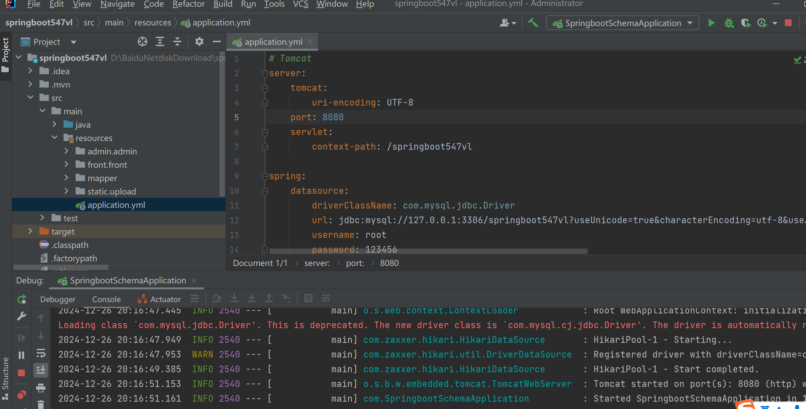

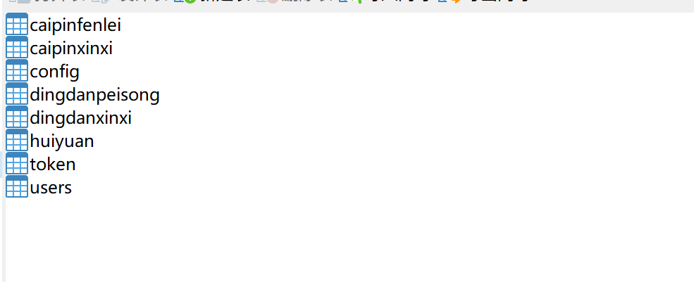

# 四、相关功能介绍

#### 1).客户端

###### 1.登录

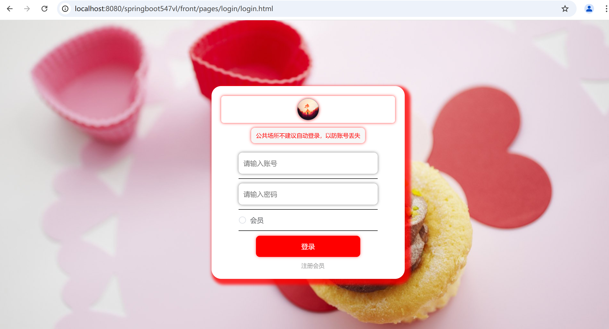

###### 2.注册

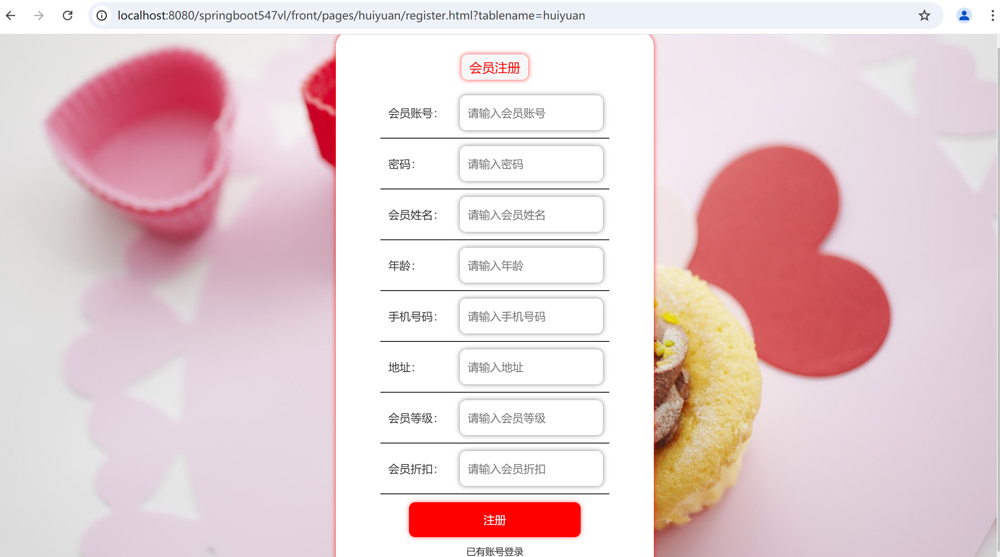

###### 3.首页

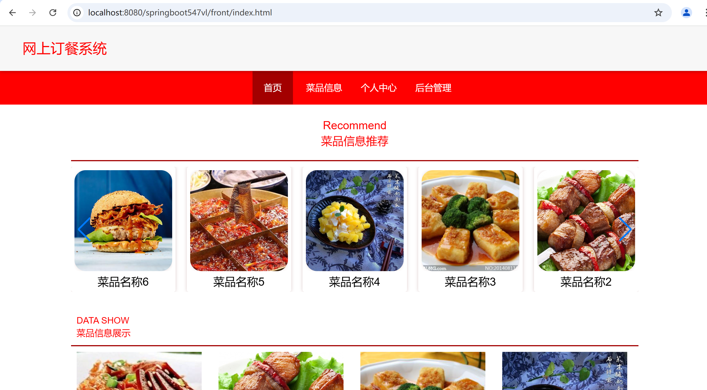

###### 4.菜品信息

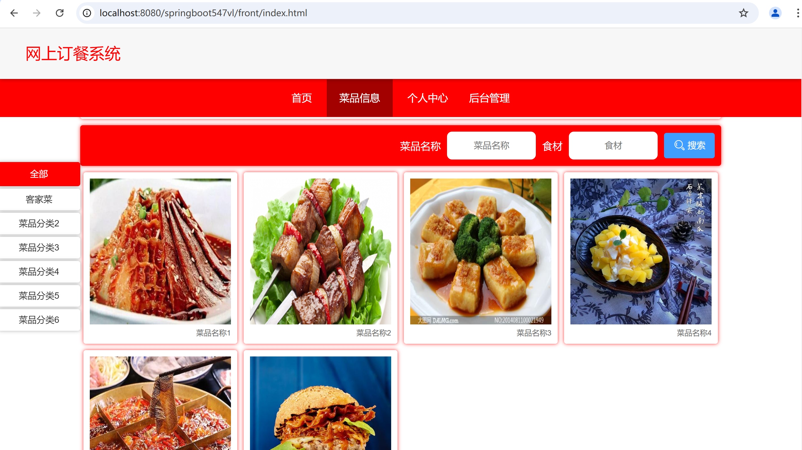

###### 5.菜品详情+下单

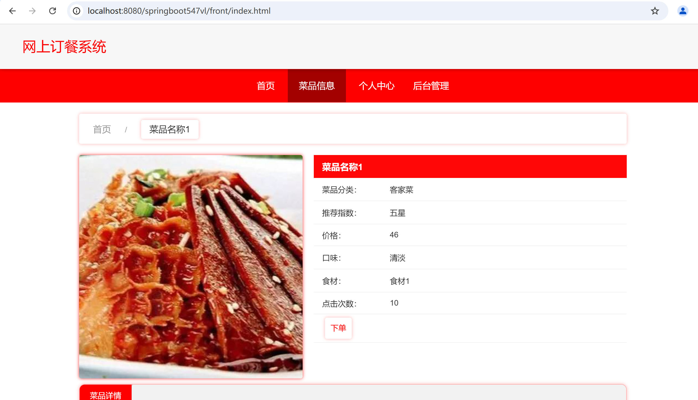

###### 6.个人中心

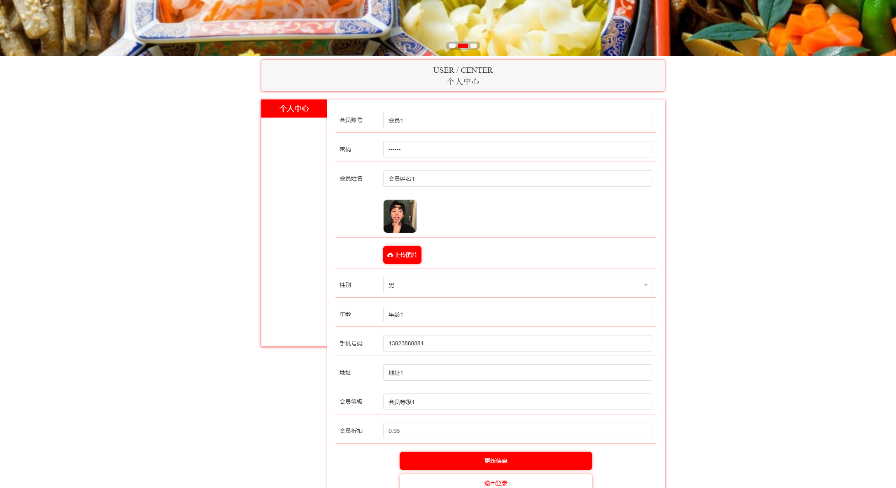

###### 7.后台管理-订单信息管理

包含:支付订单、详情功能

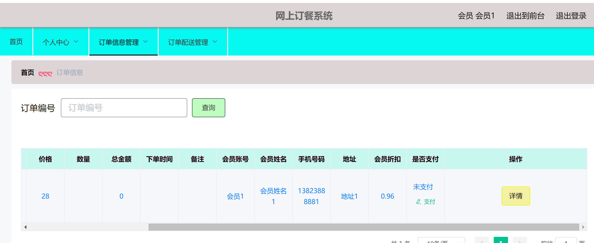

###### 8.订单配送

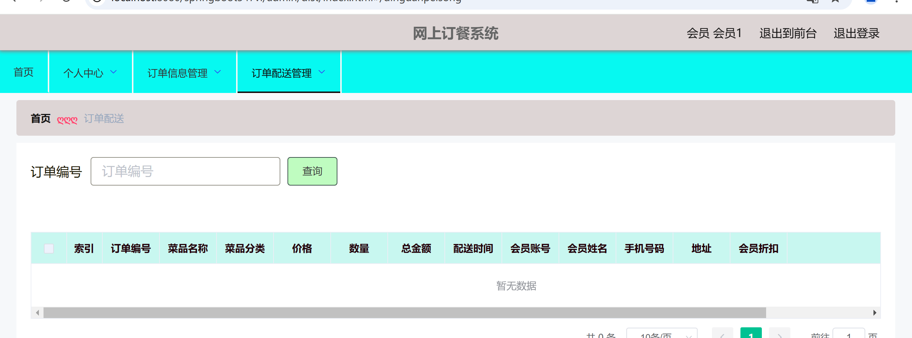

#### 2).管理端

###### 1.登录

###### 2.个人中心->修改密码

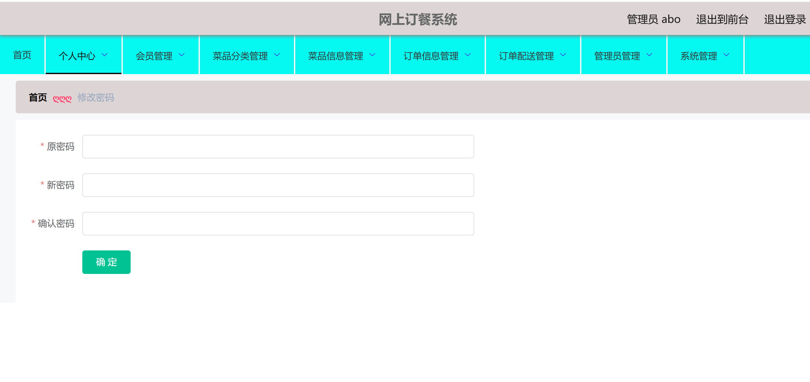

###### 3.会员管理

包含:详情、删除、修改、查看、新增功能

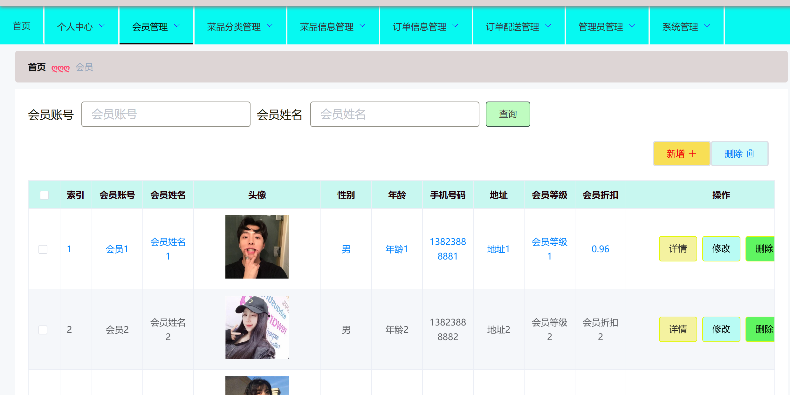

###### 4.菜品分类管理

包含:详情、删除、修改、查看、新增功能

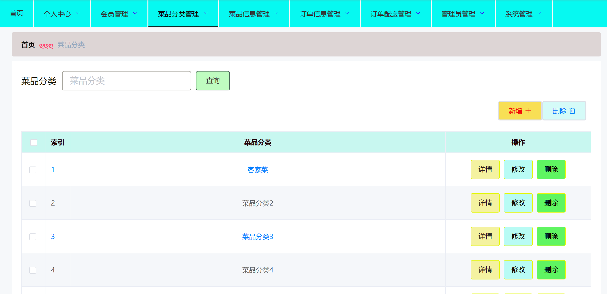

###### 5.菜品信息管理

包含:详情、删除、修改、查看、新增、下单功能

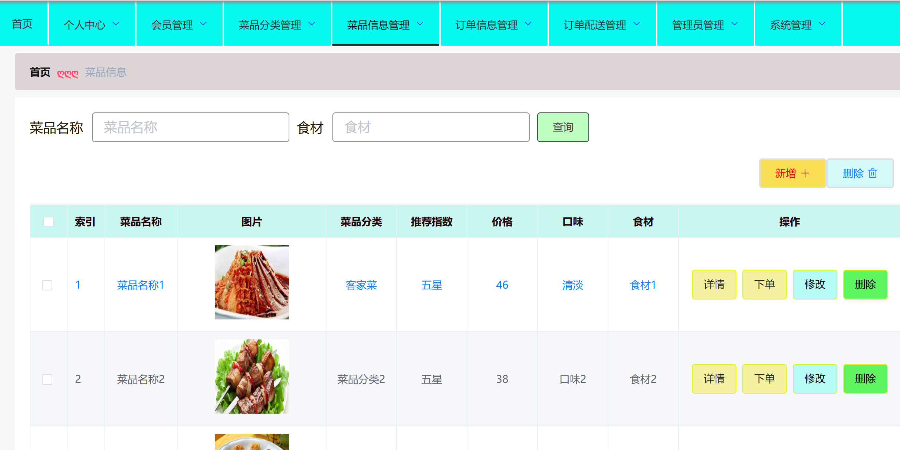

###### 6.订单信息管理

包含:详情、删除、修改、查询、配送、导出功能

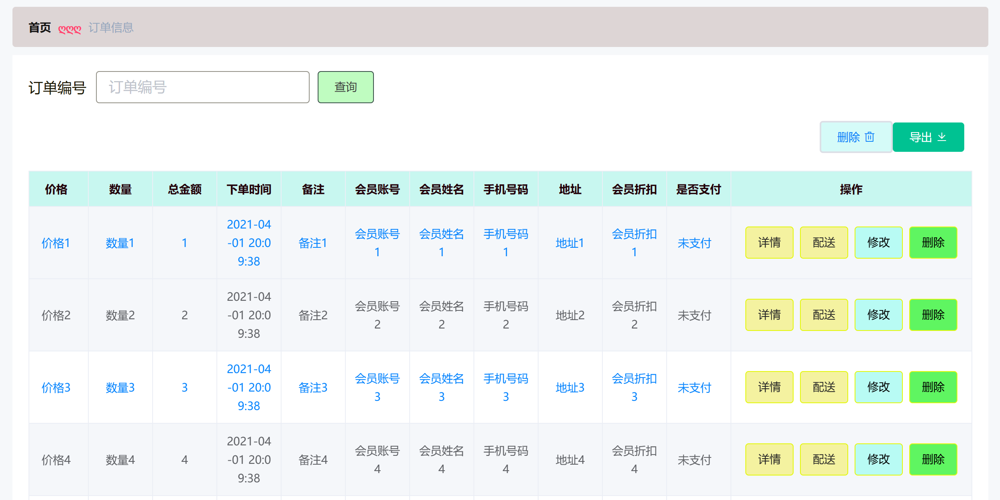

###### 7.订单配送管理

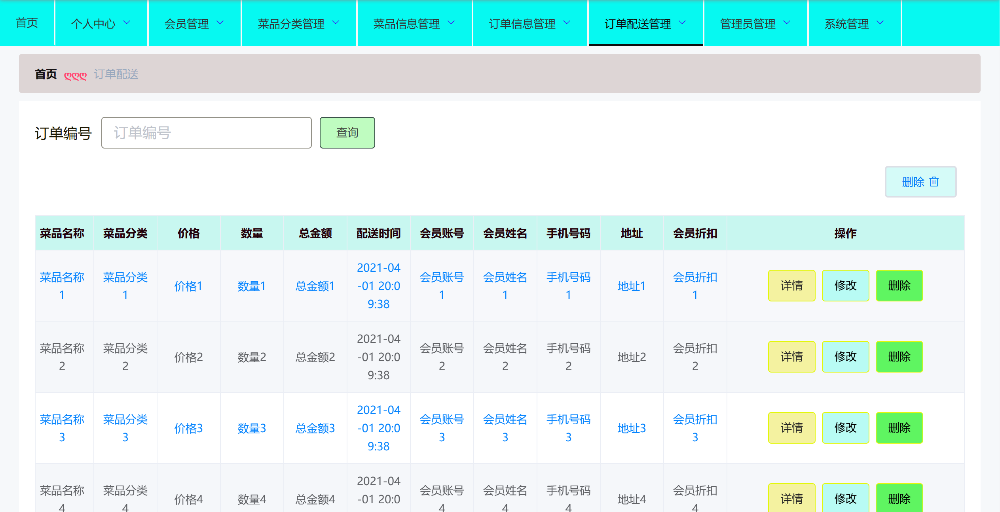

###### 8.管理员管理

包含:详情、删除、修改功能

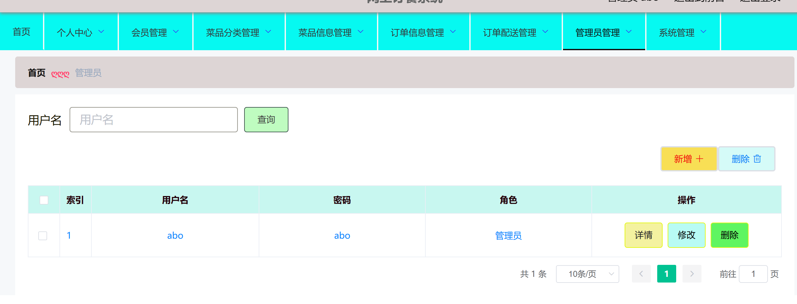

###### 9.轮播图管理

包含:详情、修改、删除功能

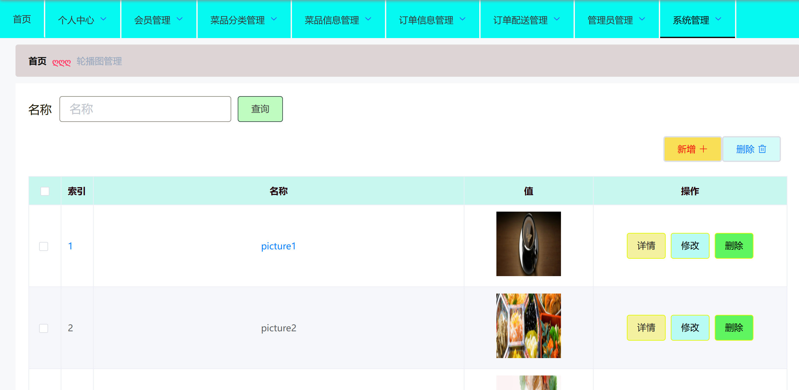

######
